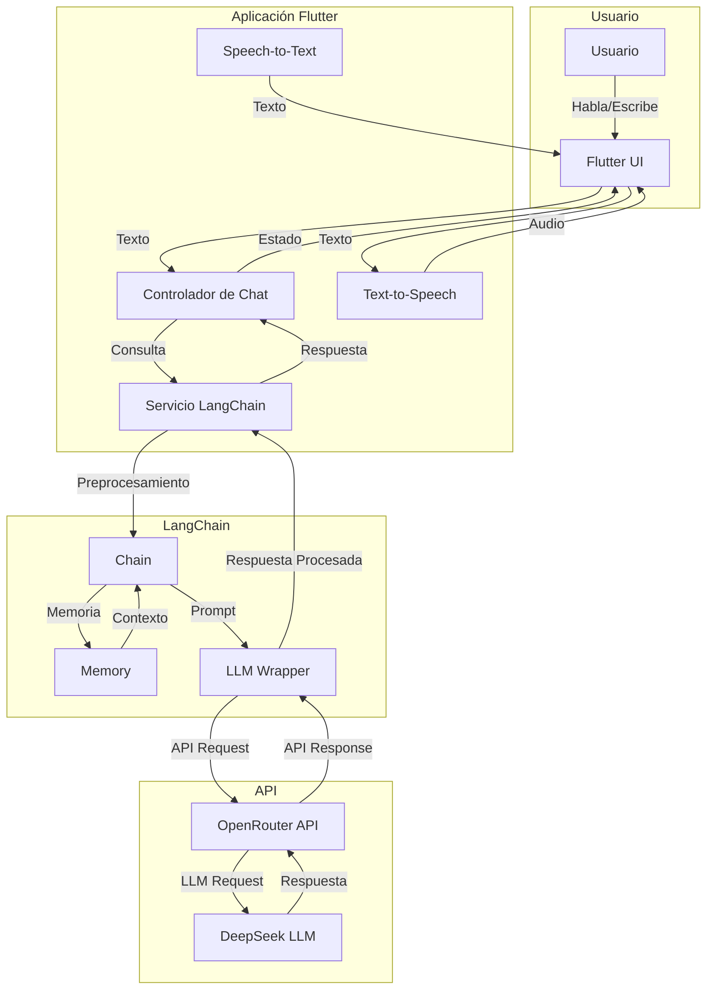

# 🚀 Chat App con LangChain y OpenRouter


Una aplicación de chat en Flutter que utiliza **LangChain** y la API de **OpenRouter** para interactuar con modelos de lenguaje avanzados. Inicialmente, el objetivo era probar la API de **DeepSeek**, pero debido a problemas de pago y restricciones geográficas, se optó por utilizar OpenRouter como alternativa y se integró LangChain para mejorar la gestión de conversaciones.

---

## 📋 Tabla de Contenidos

1. [Objetivo del Proyecto](#-objetivo-del-proyecto)
2. [Arquitectura](#-arquitectura)
3. [Tecnologías Utilizadas](#-tecnologías-utilizadas)
4. [Configuración del Proyecto](#-configuración-del-proyecto)
5. [Uso de la Aplicación](#-uso-de-la-aplicación)
6. [Estructura del Código](#-estructura-del-código)
7. [Problemas y Soluciones](#-problemas-y-soluciones)
8. [Contribución](#-contribución)
9. [Licencia](#-licencia)

---

## 🎯 Objetivo del Proyecto

El objetivo principal de este proyecto fue probar la API de **DeepSeek** para integrar un modelo de lenguaje en una aplicación de chat. Sin embargo, debido a problemas de pago (restricciones geográficas en Bolivia que impiden el uso de PayPal) y la falta de alternativas de pago, se decidió utilizar **OpenRouter** como una API externa para lograr el mismo propósito.

OpenRouter ofrece una interfaz sencilla y acceso a múltiples modelos de lenguaje, lo que permitió continuar con el desarrollo del proyecto sin depender directamente de DeepSeek. Además, se integró **LangChain** para proporcionar memoria a las conversaciones y mejorar la experiencia del usuario mediante capacidades de voz.

---

## 🔰 Arquitectura



---

## 🛠 Tecnologías Utilizadas

- **Flutter**: Framework de desarrollo multiplataforma para crear aplicaciones móviles y web.
- **Dart**: Lenguaje de programación utilizado en Flutter.
- **LangChain**: Biblioteca para crear aplicaciones con memoria y contexto utilizando modelos de lenguaje.
- **OpenRouter API**: Plataforma que proporciona acceso a modelos de lenguaje avanzados.
- **HTTP**: Para realizar solicitudes a la API de OpenRouter.
- **speech_to_text**: Para convertir la voz del usuario en texto.
- **flutter_tts**: Para convertir las respuestas de texto en voz.

---

## ⚙ Configuración del Proyecto

### Requisitos Previos

- Flutter SDK instalado (versión estable recomendada, compatible con SDK ^3.7.0-209.1.beta).
- Una clave de API de OpenRouter. Puedes obtenerla [aquí](https://openrouter.ai/).

### Pasos para Configurar el Proyecto

1. Clona el repositorio:
   ```bash
   git clone https://github.com/runinbk/DeepSeek-Prueba-T1.git
   cd DeepSeek-Prueba-T1
   ```

2. Instala las dependencias:
   ```bash
   flutter pub get
   ```

3. Configura tu clave de API:
   - Abre el archivo `lib/main.dart`.
   - Reemplaza la variable `apiKey` en el método `_initLangChain()` con tu clave de API de OpenRouter.

4. Ejecuta la aplicación:
   ```bash
   flutter run
   ```

---

## 📱 Uso de la Aplicación

1. **Iniciar la aplicación**:
   - Al abrir la aplicación, verás una interfaz con un campo de texto, un botón de micrófono y un botón de enviar.

2. **Enviar mensajes**:
   - Escribe un mensaje en el campo de texto y presiona el botón de enviar (o presiona `Enter`).
   - La aplicación enviará el mensaje a través de LangChain y OpenRouter, y mostrará la respuesta en la pantalla.

3. **Usar comandos de voz**:
   - Presiona el icono de micrófono para activar el reconocimiento de voz.
   - Habla claramente y tu mensaje será transcrito automáticamente.
   - La aplicación leerá en voz alta las respuestas.

4. **Reiniciar conversación**:
   - Presiona el botón de actualizar en la barra superior para limpiar el historial y comenzar una nueva conversación.

---

## 🧩 Estructura del Código

El proyecto está organizado de la siguiente manera:

- **`lib/main.dart`**: Punto de entrada de la aplicación. Contiene la interfaz de usuario y gestiona el reconocimiento de voz y la síntesis de voz.
- **`lib/services/langchain_service.dart`**: Implementa la integración con LangChain para manejar conversaciones con memoria.
- **`lib/services/openrouter_service.dart`**: Gestiona la comunicación con la API de OpenRouter.
- **`pubspec.yaml`**: Archivo de configuración de dependencias de Flutter.

---

## 🚨 Problemas y Soluciones

### Problema: Restricciones de Pago con DeepSeek
- **Descripción**: Debido a la crisis económica en Bolivia, los bancos han restringido las compras en línea, especialmente a través de PayPal, que es el método de pago utilizado por DeepSeek.
- **Solución**: Se optó por utilizar **OpenRouter**, que ofrece una API similar y permite el uso de tarjetas de crédito directamente.

### Problema: Mantener Contexto en Conversaciones
- **Descripción**: Las APIs de modelos de lenguaje básicas no mantienen el contexto entre mensajes.
- **Solución**: Se implementó **LangChain** para gestionar la memoria de la conversación y mantener el contexto.

### Problema: Errores en Flutter Web
- **Descripción**: Al ejecutar la aplicación en Flutter Web, se presentaron errores relacionados con el manejo de eventos y el entorno de desarrollo.
- **Solución**: Se actualizó Flutter a la última versión estable y se revisó el manejo de eventos en la interfaz de usuario.

### Problema: Accesibilidad para Usuarios
- **Descripción**: La entrada de texto puede ser lenta o difícil para algunos usuarios.
- **Solución**: Se implementaron funciones de reconocimiento de voz y síntesis de voz para mejorar la accesibilidad.

---

## 🤝 Contribución

¡Las contribuciones son bienvenidas! Si deseas mejorar este proyecto, sigue estos pasos:

1. Haz un fork del repositorio.
2. Crea una rama con tu nueva funcionalidad (`git checkout -b feature/nueva-funcionalidad`).
3. Realiza tus cambios y haz commit (`git commit -m 'Añadir nueva funcionalidad'`).
4. Haz push a la rama (`git push origin feature/nueva-funcionalidad`).
5. Abre un Pull Request.

---

## 📜 Licencia

Este proyecto está bajo la licencia **MIT**. Para más detalles, consulta el archivo [LICENSE](LICENSE).

---

## 🙏 Agradecimientos

- A **LangChain** por proporcionar herramientas para crear aplicaciones con memoria y contexto.
- A **OpenRouter** por proporcionar una API accesible y fácil de usar.
- A la comunidad de **Flutter** por su apoyo y recursos.

---

¡Gracias por usar esta aplicación! Si tienes alguna pregunta o sugerencia, no dudes en contactarme. 😊